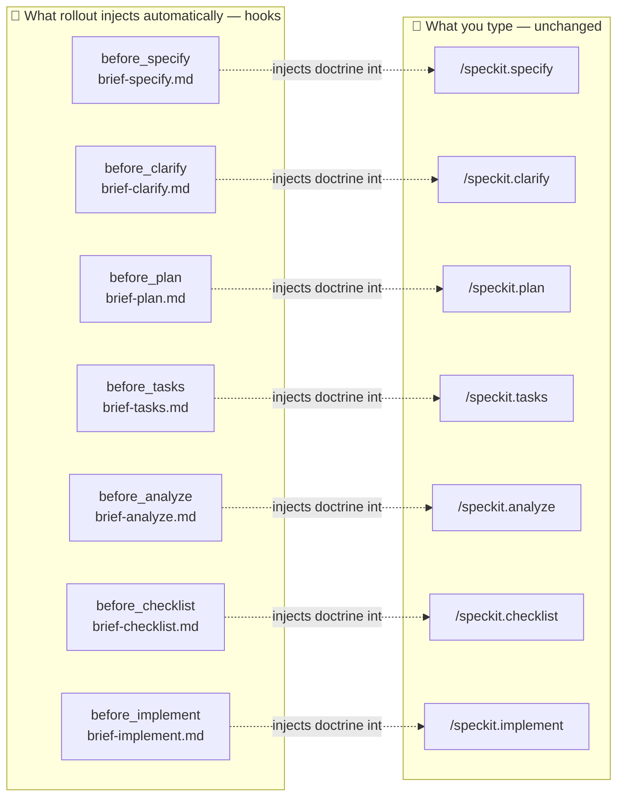
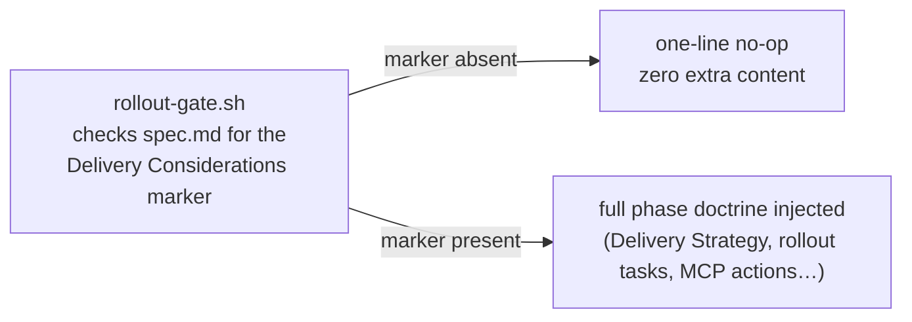

<p align="center" style="margin-top: 30px">
  
</p>

# Rollout

A [Spec Kit](https://github.com/github/spec-kit) extension that gives AI coding
agents native fluency in **progressive delivery**. `rollout` teaches the
standard Spec-Driven Development (SDD) workflow to recognize when a feature
warrants feature-flagged / canary delivery, fold a concrete rollout strategy
into specs, plans, and tasks, and execute the required provider operations
during implementation.

**Provider scope (V1): [LaunchDarkly](https://launchdarkly.com/) only.**

See [docs/foundation/vision.md](docs/foundation/vision.md) for the full
product vision and design rationale, [docs/usage.md](docs/usage.md) for a
walkthrough of the day-to-day workflow, and
[docs/providers.md](docs/providers.md) for configuring or adding providers.

## There are no new commands to learn

`rollout` adds **zero** new commands to your day-to-day SDD workflow. You keep
typing the exact same native Spec Kit commands you already know
(`/speckit.specify`, `/speckit.clarify`, `/speckit.plan`, `/speckit.tasks`,
`/speckit.analyze`, `/speckit.checklist`, `/speckit.implement`). The seven
`brief-*` files under [commands/](commands/) are **not** commands you run —
they are doctrine payloads that Spec Kit's own hook dispatcher injects
*automatically*, right before the matching native command executes:



Every hook **self-gates** first: it checks a marker in the feature's own
`spec.md`, and if the feature has no rollout signal, it emits a single no-op
line and adds nothing else — so non-rollout features look exactly as they
would without the extension installed:



The **only** things you ever run by hand are the guided setup wizard,
`speckit.rollout.config`, and its companion switch command,
`speckit.rollout.provider` — see [Quick Start](#quick-start) below.

## Quick Start

1. **Install** the extension into a Spec Kit-initialized project (see
   [Installation](#installation) below).
2. **Register the official LaunchDarkly MCP server yourself**, in your own
   client's native MCP settings (e.g. `.vscode/mcp.json`) — `rollout` never
   writes, creates, or modifies that file for you.
3. **Run the setup wizard once**, so your project/environment selection is
   saved:
   ```
   /speckit.rollout.config
   ```
   This discovers whichever MCP server(s) you've already registered,
   determines hosted vs. local automatically, and writes a
   `provider: launchdarkly` config block (never the token value — see
   [Configuration](#configuration)) to `rollout-config.yml`.
4. **Use Spec Kit exactly as before.** Describe a feature with
   `/speckit.specify`, and if it looks like a progressive-delivery candidate
   (payments, auth, a risky migration, a percentage/cohort mention, …),
   `rollout` proposes a `## Delivery Considerations` section — you can accept
   or decline. From there the same signal quietly threads through
   `/speckit.clarify` → `/speckit.plan` → `/speckit.tasks` → `/speckit.analyze`
   → `/speckit.checklist` → `/speckit.implement`, with no extra commands.

See [docs/usage.md](docs/usage.md) for a full example run and what each phase
looks like with and without rollout signal present.

## Installation

From a Spec Kit-initialized project:

```bash
specify extension add <path-or-url-to-rollout> --dev
```

## What it provides

- **9 commands** (namespace `speckit.rollout.*`): seven phase briefings
  (`brief-specify`, `brief-clarify`, `brief-plan`, `brief-tasks`,
  `brief-analyze`, `brief-checklist`, `brief-implement`) plus the guided
  setup wizard (`config`) and the provider switch command (`provider`).
  **Only `config`/`provider` are meant to be invoked directly** — the seven
  briefings exist solely as hook targets (see above).
- **7 lifecycle hooks** (`before_specify`, `before_clarify`, `before_plan`,
  `before_tasks`, `before_analyze`, `before_checklist`, `before_implement`),
  each non-optional, each running its corresponding briefing command
  automatically before the matching native `/speckit.*` command.
- **Config declaration** for `rollout-config.yml`, templated from
  `rollout-config.template.yml` (not required to install).

## Configuration

Configuration resolves in four layers, lowest to highest precedence:

1. **Extension defaults** — `config.defaults` in the installed `extension.yml`.
2. **Project config** — `.specify/extensions/rollout/rollout-config.yml`,
   committed by the team; created by copying
   [rollout-config.template.yml](rollout-config.template.yml) and filling in
   non-secret values.
3. **Local override** — `.specify/extensions/rollout/local-config.yml`, an
   optional, per-developer file overriding individual fields without
   changing what the team shares.
4. **Environment variables** — `SPECKIT_ROLLOUT_*`, matched by prefix and
   split on every underscore into nested keys (e.g.
   `SPECKIT_ROLLOUT_HOOKS_ENABLED` overrides `hooks.enabled`). Env var values
   are always raw strings, never coerced to a boolean.

A missing project or local config file is not an error — it simply
contributes nothing at that layer.

**`.gitignore` responsibility**: Spec Kit does not automatically exclude
`local-config.yml` from version control. Adopting projects must add their own
`.gitignore` rule for `.specify/extensions/rollout/local-config.yml`.

See [rollout-config.template.yml](rollout-config.template.yml) for the full
schema and inline secret-handling warnings, and
[specs/002-config-system/contracts/rollout-config-schema.md](specs/002-config-system/contracts/rollout-config-schema.md)
for the complete contract.

For provider-specific fields (today: `launchdarkly.*`) and how to add support
for another provider, see [docs/providers.md](docs/providers.md).

## Documentation

| Doc | Audience | Content |
|---|---|---|
| [docs/usage.md](docs/usage.md) | Users | Day-to-day workflow, example run, troubleshooting |
| [docs/providers.md](docs/providers.md) | Users & extension developers | Configuring the LaunchDarkly provider today; how to add a new provider |
| [docs/foundation/vision.md](docs/foundation/vision.md) | Contributors | Full product vision, decision log, scope boundaries |

## License

[MIT](LICENSE)
