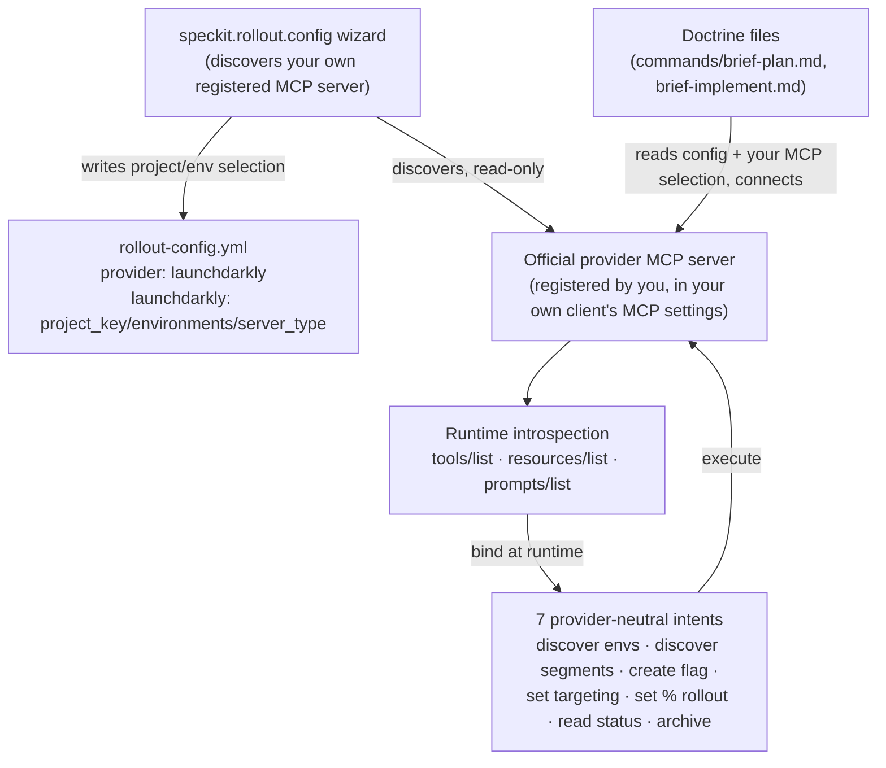

# Providers

`rollout` talks to feature-flag providers through their **official MCP
server** plus MCP's built-in discovery (`tools/list`, `resources/list`,
`prompts/list`) — never through a hand-maintained API wrapper or capability
contract (see [foundation/vision.md](foundation/vision.md) §6, Decision D3).
That single design choice is what makes provider support cheap to add later.

**Today (V1): [LaunchDarkly](https://launchdarkly.com/) is the only supported
provider.** Unleash and GrowthBook are roadmap items (vision.md §11), not yet
implemented. This page has two audiences:

- [**Using the LaunchDarkly provider**](#using-the-launchdarkly-provider) — for
  anyone configuring `rollout` in a project today.
- [**Adding a new provider**](#adding-a-new-provider-extension-developer-guide)
  — for extension developers who want to extend `rollout` beyond LaunchDarkly.



Nothing in the diagram above is provider-specific except the config block —
the doctrine's seven intents and the introspection step are already
provider-neutral, and the wizard never writes to your client's own MCP
configuration.

## Using the LaunchDarkly provider

Everything here is regular project configuration and one guided command — no
code changes. See the [README's Configuration section](../README.md#configuration)
for the full four-layer precedence (`extension.yml` defaults → project
config → local override → env vars).

### 1. Register the official LaunchDarkly MCP server yourself

Before running any `rollout` command, register the official LaunchDarkly
MCP server in your own Spec Kit client's native MCP settings (e.g.
`.vscode/mcp.json`) — `rollout` never writes, creates, or modifies that
file for you (vision.md §6.2). Export your LaunchDarkly token, once, outside
of git:

```bash
export LAUNCHDARKLY_API_TOKEN="..."   # in your shell profile, not in the repo
```

Use a scoped, least-privilege LaunchDarkly token. See vision.md §8 for the
full credential-security rationale (why this is the V1 approach vs. editor
secret stores or encrypted files). <a id="credentials"></a>

### 2. Run the guided setup wizard

```
/speckit.rollout.config
```

The wizard discovers, read-only, whichever MCP server(s) you've already
registered; automatically determines whether the one you pick is
LaunchDarkly's **hosted** or a **local** server; walks you through
project/environment selection appropriate to that server type; verifies
read access; and, after your explicit confirmation, writes exactly one
modular config block:

```yaml
provider: launchdarkly

launchdarkly:
  project_key: "my-ld-project"
  environments: ["staging", "production"]
  server_type: hosted   # or: local
```

These are **non-secret pointers only** — never a token value, and never an
MCP launcher command/args/version/repository (that concept no longer
exists; see [usage.md](usage.md#1-register-your-mcp-server-then-run-the-wizard-once-per-project)
for the full step-by-step). The wizard is safely re-runnable any time your
selections change — see [usage.md](usage.md).

That's it — no other steps are required. `brief-plan`, `brief-tasks`, and
`brief-implement` pick up `provider` and `launchdarkly.*` from resolved
config automatically once a feature has rollout signal, resolving your MCP
server selection from `local-config.yml`.

## Adding a new provider (extension developer guide)

This section is for people modifying the `rollout` extension itself, not for
end users. It walks through what a new provider (e.g., Unleash, GrowthBook)
would require, following the extension points already reserved in
[foundation/vision.md](foundation/vision.md) §11.

> **Scope check**: as of this writing, only LaunchDarkly is implemented end to
> end (V1 scope, vision.md §10). The steps below describe the concrete diffs
> needed to add a second provider — most of the doctrine does **not** need to
> change, by design.

### What already generalizes for free

- **MCP introspection & the seven provider-neutral intents**
  ([commands/brief-implement.md](../commands/brief-implement.md), Step 3.3):
  discover environments, discover segments, create flag, set targeting, set
  percentage rollout, read flag status, archive flag. These are named in
  natural language and bound to whatever tools the configured MCP server
  actually advertises at runtime — no per-provider tool-name hardcoding to
  update.
- **The `launchdarkly:` config block shape** (`project_key`, `environments`,
  `server_type`) is already provider-agnostic — a new provider adds its own
  sibling top-level block of the same shape.
- **The credential chain** is provider-agnostic and, as of Feature 013, lives
  entirely outside this project's own config — the developer's own MCP
  client and MCP server process own it completely; only the MCP server's
  name/key (never a launch command or a credential) is saved, under the
  literal, flat key `mcp_server`, in `local-config.yml`.

### What you need to change

1. **Add a provider-specific config block.**
   In [rollout-config.template.yml](../rollout-config.template.yml) and the
   `config_schema` in [extension.yml](../extension.yml), add a new top-level
   block mirroring the shape of `launchdarkly:`, e.g.:

   ```yaml
   unleash:
     project_key: ""
     environments: []
   ```

   Keep it non-secret pointers only, matching the existing
   `launchdarkly.project_key` / `launchdarkly.environments` pattern.

2. **Validate `provider` against a registry.**
   Vision.md §11 calls for the `provider` config key to resolve against a
   known registry rather than being accepted as any free string. Add the new
   provider id (e.g., `unleash`) to that registry/validation wherever
   `provider` is read.

3. **Generalize the hardcoded `Provider: LaunchDarkly` line.**
   [commands/brief-plan.md](../commands/brief-plan.md) (Step 3, element 2)
   currently writes the literal text `Provider: LaunchDarkly` into every
   `## Delivery Strategy` section. Change this to emit
   `Provider: <resolved provider display name>`, sourced from the resolved
   `provider` config value.

4. **Generalize the hardcoded `"launchdarkly"` provider name in the wizard.**
   [commands/config.md](../commands/config.md) (Step 1, Provider Selection)
   currently presents only "LaunchDarkly" as selectable, per FR-003's V1
   scope. Generalize this to present every provider with a real preset,
   sourced from a provider registry (vision.md §11 point 2), rather than a
   single hardcoded name — and generalize
   [commands/provider.md](../commands/provider.md)'s single-preset
   assumption ("in V1, only `launchdarkly` has a real preset") accordingly.

5. **Add an optional provider-specific advisory note, if truly needed.**
   Per vision.md §11 point 3 ("modular doctrine: provider-neutral rollout
   content vs. provider-specific notes"), only add a short advisory aside if
   the new provider's MCP genuinely requires one (e.g., a naming quirk). Do
   **not** re-introduce a maintained per-provider capability contract — that
   was explicitly rejected (Decision D3) because MCP's own `tools/list`
   discovery already stays fresh across provider releases.

6. **Update scope-boundary docs.**
   Update this file's provider list, the README's "Provider scope" line, and
   vision.md §1/§10/§11 once the new provider is actually implemented (not
   just planned) — keep the "V1 scope" language accurate rather than
   aspirational.

7. **Re-verify the quickstart fixtures.**
   Each `specs/0XX-*/quickstart.md` that exercises `brief-plan`/`brief-tasks`/
   `brief-implement` assumes the current single-provider wording. Re-run those
   scenarios (or add a provider-parameterized variant) to confirm the gate
   script and doctrine still behave correctly once `provider` can be more than
   `launchdarkly`.

### What you should *not* do

- Don't build a per-provider REST/API wrapper — the whole point of the MCP +
  introspection model (Decision D3) is to avoid maintaining one.
- Don't hardcode a new provider's tool names into the doctrine — bind to them
  via introspection at runtime, exactly like LaunchDarkly does today.
- Don't put a token value anywhere in config, doctrine text, or committed
  files — only the env var *name*, exactly like the existing
  `token_env_var` pattern.
