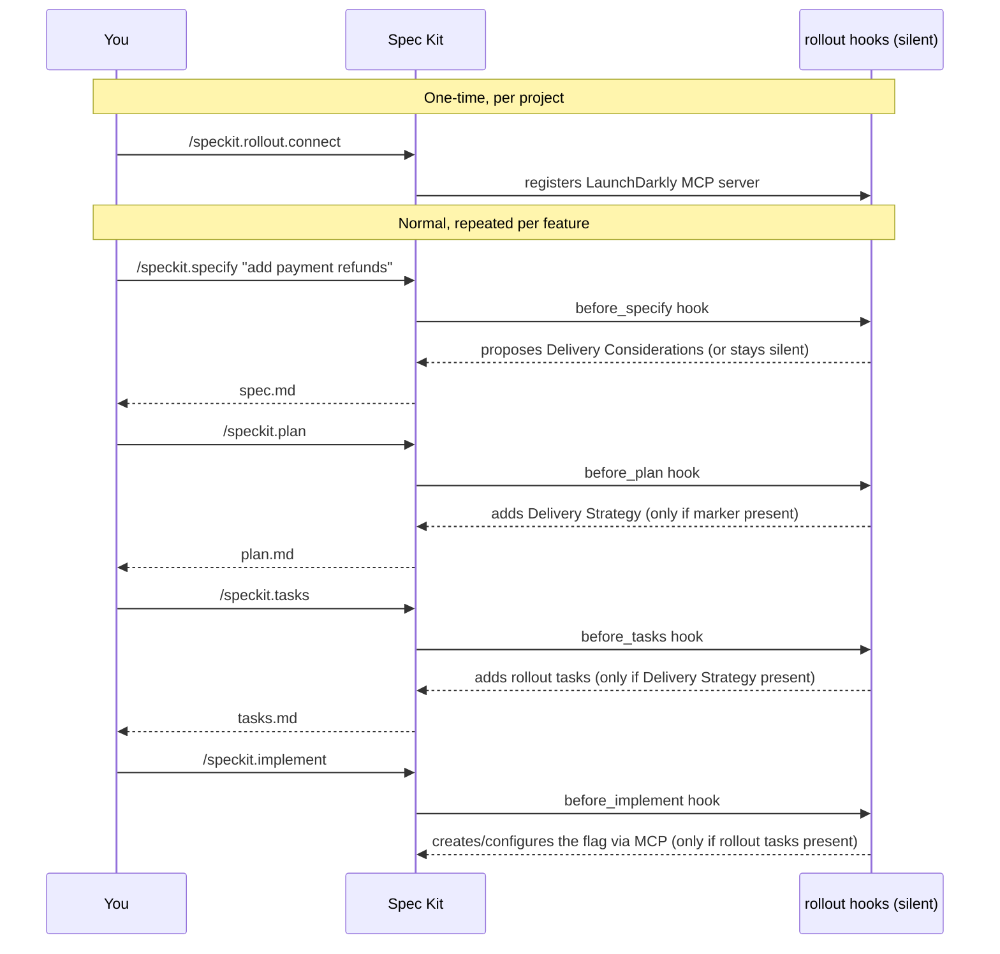

# Using `rollout`

This page is for **users** of the extension: how it fits into the Spec Kit
workflow you already run, day to day. For the underlying design rationale, see
[foundation/vision.md](foundation/vision.md). For provider configuration, see
[providers.md](providers.md).

## The one rule to remember

> You never call a `rollout` command to "turn on" rollout behavior for a
> feature. You just describe the feature normally, and `rollout` decides —
> transparently, via a marker in `spec.md` — whether to get involved.

The only command you ever type yourself is the one-time setup command,
`speckit.rollout.connect`. Everything else is standard Spec Kit:



## Step-by-step

### 1. Install and connect (once per project)

```bash
specify extension add <path-or-url-to-rollout> --dev
```

Then, inside your Spec Kit client:

```
/speckit.rollout.connect
```

`connect`:
- detects your active Spec Kit client (Copilot, Claude Code, Cursor, Cline,
  Gemini CLI, Codex, …),
- writes the pinned LaunchDarkly MCP server entry into that client's MCP
  config file (or prints a copy-paste snippet if your client doesn't support
  project-scoped MCP config yet),
- **never writes a credential value** — only the name of the environment
  variable the MCP server reads at launch.

You still need to export the actual token yourself, once, in your shell
profile (see [providers.md](providers.md#credentials)):

```bash
export LAUNCHDARKLY_API_TOKEN="..."
```

Re-running `connect` at any time is safe — it's idempotent and only touches
the `launchdarkly` entry it owns.

### 2. Work normally — `/speckit.specify`

Describe your feature as usual. Nothing about how you write the description
changes. Behind the scenes, `before_specify` runs the shared gate script
against the *new* feature's `spec.md`, finds no marker yet (it's a brand-new
feature), and falls back to its own detection heuristics on your description:

| Signal category | Example |
|---|---|
| High-risk / irreversible change | payments, auth, data migration |
| Major UX change | a significant redesign of a user flow |
| Progressive / staged migration | a multi-step replacement rollout |
| Explicit cohort / audience language | beta, internal, canary, a percentage, a region |
| Performance/infra-sensitive change | meaningful blast radius |

- **Clear match** → the agent proposes a `## Delivery Considerations` section
  and explains why; you can accept or decline.
- **Ambiguous** → the agent asks exactly **one** targeted clarifying question,
  then proceeds based on your answer.
- **No match** → nothing is added; `spec.md` looks exactly as it would without
  the extension installed.

### 3. `/speckit.clarify` — the marker survives

If `spec.md` carries the marker, `before_clarify` treats it as legitimate spec
content — never as underspecified noise to strip out — and instead elicits any
missing rollout parameters (phases, audience, percentages, telemetry gates,
rollback conditions) directly into the marker section.

### 4. `/speckit.plan` — Delivery Strategy

If the marker is present, `before_plan` adds a `## Delivery Strategy` section
to `plan.md`: flag name(s), `Provider: LaunchDarkly`, phased rollout,
targeting, telemetry gates, rollback conditions. If you introduce rollout
intent for the *first time* at this phase (e.g., "release to 5% first" in your
`/plan` arguments) rather than at specify time, `before_plan` back-fills the
marker into `spec.md` so every later phase still sees it.

### 5. `/speckit.tasks` — concrete rollout tasks

If `plan.md` has a `Delivery Strategy` section, `before_tasks` emits ordered
tasks derived **from the plan** (never re-mined from the spec): create flag,
configure environments, configure targeting, integrate SDK, add telemetry
validation, define rollback conditions.

### 6. `/speckit.analyze` and `/speckit.checklist`

- `before_analyze` cross-checks that the marker (spec) ↔ Delivery Strategy
  (plan) ↔ rollout tasks (tasks) chain is consistent, and suppresses
  false-positive orphan/duplication findings for rollout content.
- `before_checklist` adds rollout-quality checklist items (flag naming,
  targeting, telemetry gates, rollback, phase ordering) when the chain exists.

### 7. `/speckit.implement` — real provider actions

If rollout tasks exist, `before_implement` introspects the pinned LaunchDarkly
MCP server (`tools/list`, `resources/list`, `prompts/list`) and executes the
create-flag / configure-environments / configure-targeting actions using the
parameters from `plan.md` and `tasks.md`. Two guardrails are always enforced:

- it **never** advances live production exposure beyond what the task/plan
  explicitly specifies, unless you say so explicitly in that session;
- it **never** reads, echoes, or logs the API token value.

If no MCP server is reachable, it falls back to plan-only mode and records a
single task pointing at `/speckit.rollout.connect`.

## What "near-zero noise" looks like

Every hook self-gates on a single shared script before doing anything else:

```bash
scripts/bash/rollout-gate.sh
# hasFlags=<true|false>
# flags=<comma-separated candidate flag names>
# source=<spec.md|plan.md|tasks.md|(empty)>
# hooksEnabled=<true|false>
```

For a feature with no rollout signal, every phase's hook prints one line and
stops — the generated `spec.md`/`plan.md`/`tasks.md` are byte-for-byte what
you'd get without `rollout` installed at all.

## Turning it off

- **Per team**: set `hooks.enabled: false` in
  `.specify/extensions/rollout/rollout-config.yml` (see
  [providers.md](providers.md) for the full config layering).
  Also see [providers.md](providers.md#credentials) for token handling.
- **Per project, permanently**: uninstall the extension.

## Troubleshooting

| Symptom | Cause | Fix |
|---|---|---|
| No `Delivery Considerations` proposed for an obviously risky feature | Description didn't match any heuristic strongly enough | Mention the risk/cohort explicitly, or add the section by hand — the marker format is documented in [foundation/vision.md](foundation/vision.md) §5.1 |
| `brief-implement` says "no rollout tasks found" | `tasks.md` was generated before `Delivery Strategy` existed in `plan.md` | Re-run `/speckit.tasks` |
| `connect` prints a copy-paste snippet instead of writing a file | Your client isn't in the adapter table, or doesn't support project-scoped MCP config | Paste the snippet manually into your client's MCP config |
| MCP actions skipped during `/speckit.implement` | MCP server unreachable (token not exported, wrong pin) | Export the token env var, verify `rollout-config.yml`'s `mcp.*` block, re-run `/speckit.rollout.connect` |
